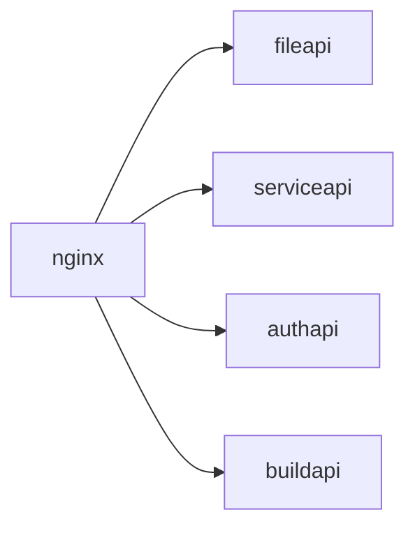
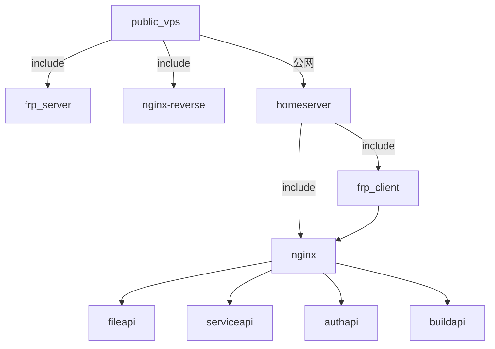
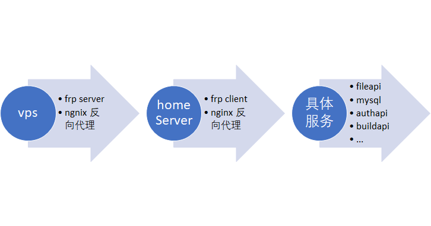

# 内容

该文档主要记录将云VPS迁移到home server的过程,原来的云服务器包括nginx docker, fileapi docker, serviceapi docker, authapi docker, mysql docker等多项服务



现在实现一种方案将上面的服务放到本地主机，外网vps只需要提供公共IP实现内网穿透



新的方案解释：

用户发起对a.example.com请求->公网ngnix反向代理接收该请求,
nginx将请求转给a.example.com:8888, 8888端口正是frp_server服务侦听的端,
frp_server将请求转发给frp_client,frp_client服务驻留到homeServer上，frp_client根据配置规则
将a.example.com转发给homeServer上的ngnix服务，ngnix将请求转给具体的应用

值得注意的是，homeServer的请求转向都是通过域名转向的，因为具体的服务都在本地，所以/etc/hosts需要
增加域名定向比如: a.example.com 127.0.0.1

  

## 公网服务器配置
公网服务器采用windows操作系统

### 配置nginx反向代理
打开nginx/conf/nginx.conf文件配置反向代理

```ini

#error_log  logs/error.log;
#error_log  logs/error.log  notice;
#error_log  logs/error.log  info;

#pid        logs/nginx.pid;
events {
    worker_connections  1024;
}


http {
    server {
        listen       80;
        server_name  a.example.com;
        location / {
            proxy_pass http://a.example.com:8888;
        }
    }
}

```

### 配置frps.ini

打开frps.ini文件 配置内容如下

``` ini
[common]
# frps服务端口
bind_port = 7000
# 外网请求a.example.com->ngnix->a.example.com:8888->vhost_http->7000->frp-client
vhost_http_port = 8888
```

### 配置自动运行frps,ngnix 2个服务器


## HomeServer 配置

homeServer采用raspberry做服务器, 操作系统采用ubuntu 20.04.5

### 检查服务器版本

```bash
lsb_release -a
#output
No LSB modules are available.
Distributor ID: Ubuntu
Description:    Ubuntu 20.04.5 LTS
Release:        20.04
Codename:       focal
```

### 更新阿里云sourcelist

```bash
#backup
sudo cp /etc/apt/sources.list /etc/ap/sources.list.back
sudo vi /etc/apt/sources.list
#按 i进入编辑模式，ctl+v粘体aliyun镜像地址
deb https://mirrors.aliyun.com/ubuntu-ports xenial main restricted universe multiverse
deb https://mirrors.aliyun.com/ubuntu-ports xenial-security main restricted universe multiverse
deb https://mirrors.aliyun.com/ubuntu-ports xenial-updates main restricted universe multiverse
deb https://mirrors.aliyun.com/ubuntu-ports xenial-proposed main restricted universe multiverse
deb https://mirrors.aliyun.com/ubuntu-ports xenial-backports main restricted universe multiverse
#保存退出
#更新软件列表及软件
sudo apt update
sudo apt upgrade
```
## 安装frp client

### 下载frp

下载地址 https://github.com/fatedier/frp/releases


```bash
#amd64 raspberry 不支持
wget https://github.com/fatedier/frp/releases/download/v0.44.0/frp_0.44.0_linux_amd.tar.gz
tar -xzvf v0.44.0/frp_0.44.0_linux_amd.tar.gz 
mv v0.44.0/frp_0.44.0_linux_amd frp
cd frp
sudo mkdir /etc/frp
sudo cp ./frp/frpc /usr/bin
sudo cp ./frp/frpc.ini /etc/frp

```

### 文件说明

```
#服务器端执行命令
frps.exe -c frps.ini

#客户端执行命令
frpc -c frpc.ini

#frpc as service

[Unit]
Description=frp client
After=network.target
Wants=network.target

[Service]
Type=simple
ExecStart=/usr/bin/frpc -c  /etc/frp/frpc.ini
Restart=always
RestartSec=20s
User=nobody
LimitNOFILE=infinity

[Install]
WantedBy=multi-user.target
```

### frpc.ini配置

```json
[common]
server_addr = [vps ip]
server_port = 7000

[web]
type = http
local_port = 80
#本地多项服务
custom_domains = a.ioliz.com, b.ioliz.com
```

### 启动服务
```bash
sudo systemctl start frpc
```

## 安装DOCKER


## 恢复DOCKER镜像

## 域名重定向


## 笔记


<a href="https://github.com/adam-p/markdown-here/wiki/Markdown-Cheatsheet">git wiki sytax</a>
<a href="https://blogs.msdn.microsoft.com/friis/2016/08/25/setup-iis-with-url-rewrite-as-a-reverse-proxy-for-real-world-apps/">windows server iis如何创建反向代理</a>
